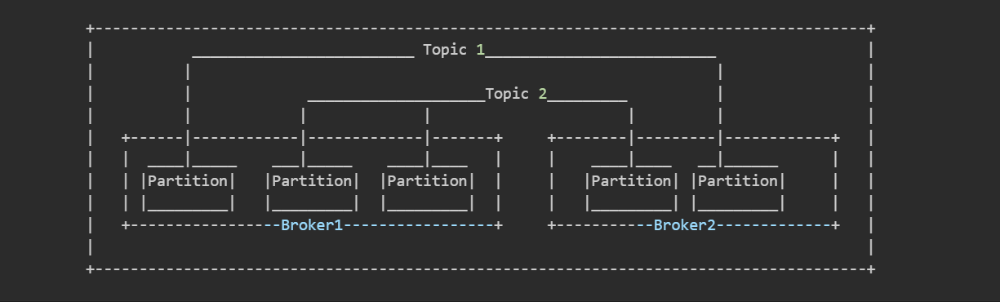
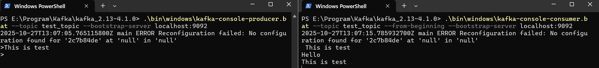

# **KAFKA DEPLOYMENT**
<br><br>

## **INTRODUCTION**


Together with the data generated every second, the requirement of scaling and processing time series data has been developed. When the producer( Data source like Internet, sensors,...) generate the data, that data will be received by customer( Processing programe) to process. In fact, there are some difficulties preventing how the data is transfered from producers to customers in real time:

* The Producers generates more than the processing ability of customers. This causes the overload of the customers and the 
data which has not been processed yet may be loss.

* The Producer generates less than the processing ability of customers. This leads to that the customers can not optimize the their processing progress.

* How to store the data which has not been processed yet.

--> *APACHE KAFKA*

**Apache Kafka** is a distributed event streaming platform. This works as a middle center which helps:

* Temporary store data generated by producers and also provide customers with these data. Thanks to this, the producers can generate unlimitedly without lossing data, and customers always have data to process.

* With a large amount of data, **Kafka** also has mechanism of scale and fault tolerance. The secret is that it manages groups of nodes called *clusters* for data distribution.
<br><br><br><br>

## **ELEMENTS OF APACHE KAFKA FOR SCALING DATA**

### **1 |Cluster**

Apache Kafka manages groups of nodes, this is called *Clusters*. Each node, called *Broker*, may be physical (real laptops, real PCs, real servers,...) or virtual( virtual machines sharing RAM and hard disk with the physical hardware of device).

These nodes are responsible for distributing data. Thanks to this, a large volumn of data can be scaled more easily because the new nodes, which are utilized to store data, are added into cluster to expand the size of the cluster. The addition of nodes is easy to deploy.

```css
                +-----------------------+
                |                       |
                |  +-------+  +-------+ |
                |  | Broker|  | Broker| |
                |  +-------+  +-------+ |
                |                       |
                |       +-------+       |
                |       | Broker|       |
                |       +-------+       |
                |                       |
                +-------A CLUSTER-------+
```

### **2 |Broker - Topic - Partition**

Partitions are where the data is written. Data is written into partitions sequentially, Kafka does not support modifying and deleting data in history. Partitions are replicated and stored in different places( these places are *broker* ) for fault tolerance. Among the partitions'version, there is a version which is main, and it is called "Leader". The else are "Followers" for backup.

Brokers are nodes in a cluster. Brokers are where partitions are physically stored.  Among brokers, there is a controller broker for management. This will manage read, write data into other brokers, and ensure the sync of data in the whole cluster.

A topic contains partitions logically. Topic is a group of partitions which are relative with each others. 

Broker V/S Topic: 

* Topic "basketball" contains 3 partitions: partition 1 has information of 500 players, partition 2 includes information of 200 other players, partition 3 contains information of 150 ones.

* Broker 1 contains 4 partition: 2 partition of Topic "basketball", 1 partition of Topic "football", 1 partition of Topic "chess". The rest of the partition of an topic may be stored physically in other brokers. Broker may not contain full partitions of a topic.



### **3 |Producer - Consumer**

Producer: provides data and push into broker - consumer: receives data from broker from broker and process.

```css
             +-------+
Producer --> | Broker| --> Customer              
             +-------+   

```

### **4 |Zookeeper( KRaft in new version) - Controller broker**

Zookeeper is a service helping controller broker manage the cluster. In particular, it helps with managing synchronization and managing which brokers are dead and need to be scheduled to re-run. The management is done through meta-data file system. Metadata contains:

* Information of brokers: List of running brokers and their Ids
* Information of Topics and Partitions: Topic config, number of partition and their positions
* Information of Leader/Follower: Which partition is *Leader* and which is *Follower*
* Information of Controller: which broker is *Controller*

**With Zookeeper**: Zookeeper is an outside service, hosted independently by the third side to store the meta-data files. The *Controller broker* has to interact with the zookeeper to read, write, modify meta-data file for ensure the sync of data.

**With KRaft**: KRaft is also where the metadata files are stored, but the **Controller Broker** is responsible for KRaft instead of a third service.
<br><br><br><br>

## **PIPELINE OF DEPLOYING A KAFKA SYSTEM**

```txt
    [1] Determine the hardware base:
        - How many brokers will be used?
        - What are IP ports of brokers?

    [2] Set up hardware base:
        - Download, install, set up and run Kafka in each broker
        - Config brokers for communication duties

    [3] Set up for sending and receiving messages:
        - Set up topic, producer and customer
        - Send and receive messages

    [4] Close system    
```
<br><br><br><br>

## **[SET UP HARDWARE BASE] | Running a Kafka broker**

Each computer is considered as a broker( physical node), running kafka in a computer also means running a broker. To run a group of brokers in which each node can communicate with each other, we have to run kafka in a group of computers with suitable config. This section will present a general pipeline of how to run kafka in a physical computer, but not show clearly how to config a broker.

### **[1] Install Java 11+**

Kafka needs Java to run -> we have to install Java
* Download from https://adoptium.net/
* Run file `.msi` downloaded to install
* After installation: check the version by opening `cmd` and run this:
    ```bash
    java -version
    ```

    The result should be:

    ```bash
    java version "21.0.2" 2024-01-16 LTS
    Java(TM) SE Runtime Environment (build 21.0.2+13-LTS-58)
    Java HotSpot(TM) 64-Bit Server VM (build 21.0.2+13-LTS-58, mixed mode, sharing)
    ```

### **[2] Install Kafka**

* Download Kafka for Windows from https://kafka.apache.org/downloads:
    * Access the link
    * Choose version: **Binary download** and download( file `.tgz`)

* Extract file downloaded
* After extraction, the result folder should be in structure:
    ```txt
    \kafka_<version>
    |__ \bin
    |__ \config
    |__ \libs
    |__ \licenses
    |__ \site-docs
    |__ LICENSE
    |__ NOTICE
    ```

### **[3] Set up KRaft**

* Create new folder for save metadata in cluster

* Initialize cluster KRaft:
    * Open `cmd` or `Terminal` and run:
        ```bash
        cd <folder_kafka>
        .\bin\windows\kafka-storage.bat random-uuid
        ```
        --> This will generate a UUID string which is the ID of cluster. This cluster ID is saved in C:\\tmp\kraft-combined-logs or E:\\tmp\kraft-combined-logs by default
        --> Copy the UUID 
        
    * Format storage for Kafka:
        ```bash
        .\bin\windows\kafka-storage.bat format -t <cluster id> -c .\config\server.properties --standalone
        ```
        --> The result should be : `Formatting complete`

### **[4] Run Kafka**

* Run:
    ```bash
    .\bin\windows\kafka-server-start.bat .\config\server.properties
    ```
    * `.\bin\windows\kafka-server-start.bat` : instruction running current broker

    * `.\config\server.properties` : path to config file. This config is responsible for setting up the parameter of the broker: IP, ID, is this broker a controller?,..... This section will not show how to set up the config file. By default, the running broker is controller.

    --> The result should be logs which are something like `Kafka Server started in KRaft mode`

    --> This means the Kafka is running successfully

* The console running Kafka must be kept running while the whole system is activating. 

### **[5] Test some instructions**

[Test some instructions to send and receive messages inside a broker - The progress of sending and receiving messages is particularly presented in other section]

### **[6] Safely close Kafka**

In terminal where Kafka is running: `CTRL + C`. Data that has been created like clusters, topic,... will not be deleted.
<br><br><br><br>

## **[SET UP HARDWARE BASE] | Config brokers in a cluster**

To run a cluster which is a network of brokers, we have to do some configurations to help brokers communicate with each other. In the instruction running Kafka, the parameter `.\config\server.properties` refers to the configuration file. In order to config a broker, we do some setting up in this file.

### **[1] - Prepare hardwares**
* Ensure that each broker in cluster( each computer) has Kafka

* Ensure the brokers are in a LAN

* Determine IP address of each broker in LAN

* Ensure that the fireware of each broker allows to send and receive request from port where the broker is running:
    * Turn off firewall in all of the brokers:

    ```txt
    Window Security
    --> Firewall and Network Protection
    --> Private Network
    --> Turn off
    ```

    * Ping to other brokers:
    ```bash
    ping <IP_of_other_broker>
    ```
    --> The result should be something like:
    
    ```bash
    Reply from <destination_IP>: bytes=32 time=137ms TTL=128
    ```

### **[2] - Create Cluster ID**

* This is done once and only in a broker

* Run instruction in `cmd`:
    
```bash
.\bin\windows\kafka-storage.bat random-uuid
```

--> The result should be a UUID string. This is the ID of cluster.

### **[3] - Config each broker**

* Open configuration file `.\config\server.properties`

* Config the following properties in each file:

    * Config unique properties:
        * `node.id` : This must be unique, different brokers should have different `node.id`:

            ```json
            node.id=1 or node.id=2 or ...
            ```
        * `log.dirs` : This refers to where the log file is saved in each broker. This must be unique

        * `listeners`: By default: `listeners=PLAINTEXT://:9092,CONTROLLER://:9093`. This should be configed:
            ```json
            listeners=PLAINTEXT://<IP_of_broker>:9092,CONTROLLER://<Ip_of_broker>:9093
            ```
        * `advertised.listeners`: where the other brokers send requests to. Config:

            ```json
            advertised.listensers=PLAINTEXT://<IP_of_broker>:9092
            ```
    * Config general properties:
        * `process.roles`: roles of node: controller or not.

            ```json
            process.roles=broker,controller
            ```
        
        * `controller.quorum.voters`: list of controller nodes. This must show the IP of controller brokers and their corresponding port for transporting metadata information.
            ```json
            controller.quorum.voters=<ip_node_1>:<port>,<ip_node_2>:<port>,...
            ```
* Save the configuration

### **[4] - Start brokers**

* Run this instruction in each broker for formating log directory:

    ```bash
    cd <folder_kafka>
    .\bin\windows\kafka-storage.bat format -t <cluster.id> -c <path_to_config_file_of_broker>
    ```

* Start broker: 
    ```bash
    .\bin\windows\kafka-server-start.bat <path_to_config_file_of_broker>
    ```

* Test: producer in a broker sends messages to a topic, consumer in another broker receives messages.

### **[5] - End Kafka**

* `CTRL + C`  to cancel kafka in a broker  
--> the other will be stuck because it is voting for leader but not receives any response.

* Waiting for the rest broker to terminate
<br><br><br><br>

## **[SET UP FOR SENDING AND RECEIVING MESSAGES]**

A Kafka cluster contains many brokers. Each broker( a physical or virtual computer) itself can send and receive message thanks to the tools *Producer* and *Consumer* installed right in kafka. In fact, the a Kafka cluster contains many brokers which store some partitions. So the question is that when a broker sends messages, which broker - particularly, which partitions in brokers - will receive the messages to store. 

To solve this, Kafka has *Topic*. *Topic* is interface for producer to send and receive messages: Producer just cares for the destination topic, similarly, the consumer only cares about the source topic. And Kafka will automatically care for the base: it manages which brokers and which partitions will be received and store message.

Pipeline of sending and receiving messages: Create Topic -> send and receive messages

### **|1| - Create a new topic** 

A topic is responsible for logical partitions management. These partitions may be physically stored in different brokers but they contain data of the same domain. To create a new topic:

Open a new `cmd` or `Terminal` or `Powershell` and run:

```bash
cd <folder_kafka>
.\bin\windows\kafka-topics.bat --create --topic <name_of_topic>  --bootstrap-server localhost:<your-port> --partitions <number_of_partitions> --replication-factor <number_of_replications>
```
* `.\bin\windows\kafka-topics.bat` : instruction related to topic

* `--create` : flag for creating new topics

* `--topic <name_of_topic>` : flag determining the name the topic.

* `--bootstrap-server localhost:<port>` : flag determining the port running the kafka. Parameter `<port>` must be consistant with the `listeners=PLAINTEXT://localhost:<port>` in file .\config\server.properties. The `<port>` passed in CLI instruction shows where the client can send request, and the one in config file determines where the broker should listen to receive the request from clients. So these 2 ports must be the same.

* `--partitions <number_of_partitions>` : flag determining the number of partions of the topic

* `--replication-factor <number_of_replications>`: flag determining the number of replications of topic

--> The result should be `Created topic <name_of_topic>`
--> This means the topic is created 
    
### **|2| - Producer sends messages to a topic**

* Open a new `cmd` or `Terminal` or `Power Shell` and run

    ```bash
    .\bin\windows\kafka-console-producer.bat --topic <topic_name> --bootstrap-server <ip_of_destination_broker>:<port>
    ```
    * `<ip_of_destination_broker>`: this must be the real IP address of broker if send messages in group of brokers. If running Kafka cluster with only a broker( current device), `<ip_of_destination_broker>` is the ip of the device, can be replaced by `localhost`
    
    --> the result should be a `>`. This means it is ready for entering messages

* To send messages: Enter message after `>`, `Enter` to send
    --> the messages will be sent to the destination topic. 
    
    When running Kafka in a computer, which partition in the computer(broker) is responsible for storing the messages is determined automatically by Kafka, we do not need to manually set up. 
    
    When running Kafka in a group of brokers, which brokers will receive and store message is also determined automatically by Kafka.

    What we need to do is to config the group of brokers( config how it works together) and to send message to the target topic. Kafka system will be responsible for managing the hardware.

### **|3| - Consumer gets messages from a topic**

* Open a new `cmd` or `Terminal` or `Power Shell` and run

    ```bash
    .\bin\windows\kafka-console-consumer.bat --topic <topic_name> --from-begining --bootstrap-server <ip_of_destination_broker>:<port>
    ```
    * `<ip_of_destination_broker>`: this must be the real IP address of broker if send messages in group of brokers. If running Kafka cluster with only a broker( current device), `<ip_of_destination_broker>` is the ip of the device, can be replaced by `localhost`

    * `--from-beginning`: ensure that consumer will read all of the messages in topic

### **|Example|**



### **|4| - Close producer and consumer**

`CTRl + C`

### **|Note|**

CANNOT DELETE OR MODIFY DATA IN TOPIC, KAFKA ONLY SUPPORT APPEND DATA.
