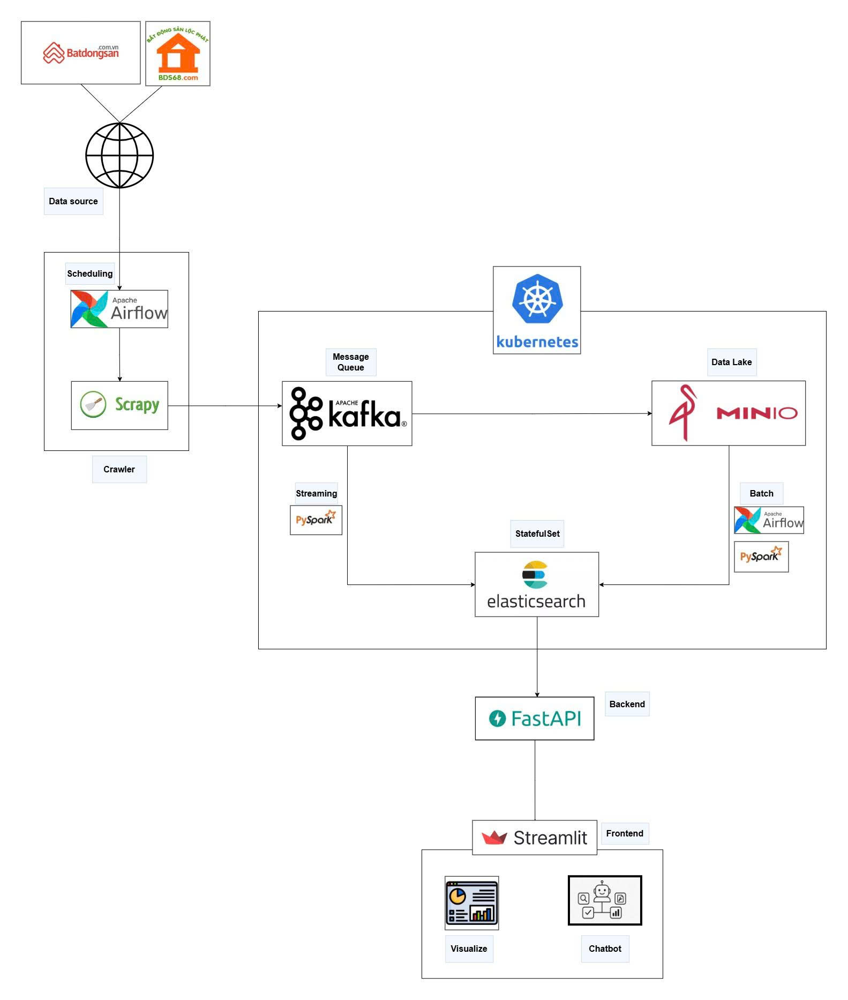
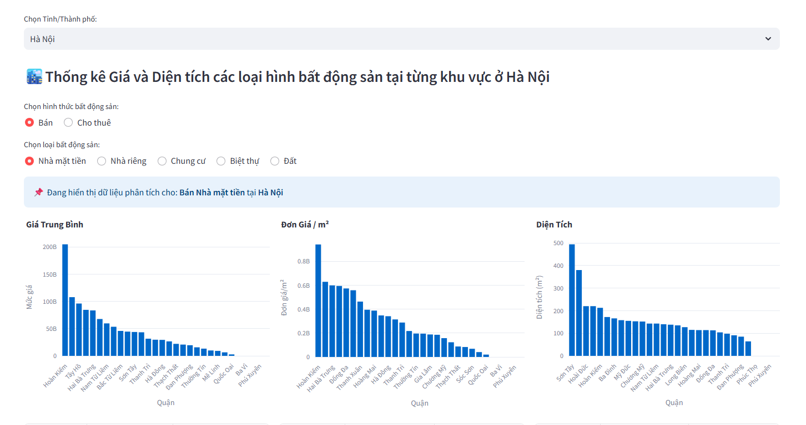
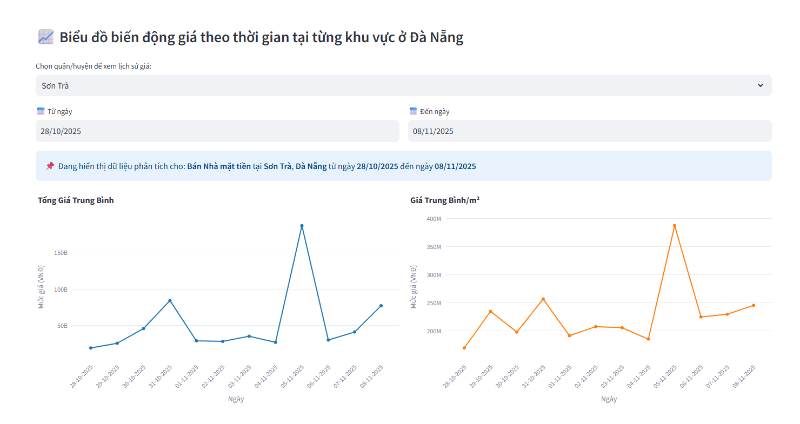
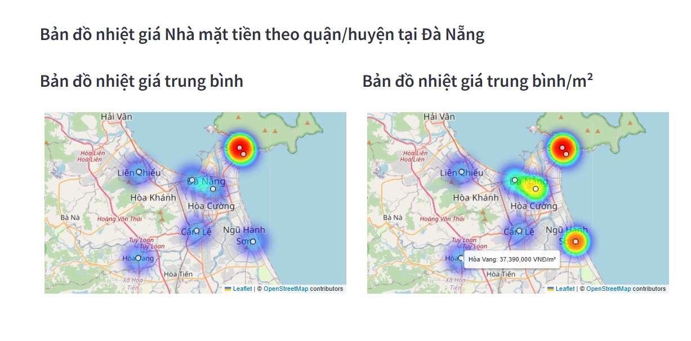

# Bigdata Project - Vietnam Real Estate Big Data System

## 1. Giới thiệu về project
- Trong bối cảnh thị trường bất động sản Việt Nam phát triển nóng, dữ liệu giao dịch bùng nổ nhưng lại phân mảnh, thiếu chuẩn hóa và chứa nhiều nhiễu trên các nền tảng trực tuyến. Điều này khiến nhà đầu tư gặp khó khăn trong việc đánh giá xu hướng và định giá tài sản.

- Dự án này được xây dựng để giải quyết bài toán trên bằng cách triển khai một Data Pipeline tự động hóa dựa trên Kiến trúc Lambda và Kubernetes. Hệ thống có khả năng thu thập, xử lý khối lượng lớn dữ liệu phi cấu trúc theo thời gian thực, từ đó cung cấp các phân tích thị trường chính xác và công cụ tư vấn thông minh.
## 2. Data source
- Dữ liệu thời tiết được lấy từ các website Bất động sản lớn trong nước, thường xuyên cập nhật hàng ngày: [bds.com](https://bds.com.vn) và [bds68.com](https://bds68.com.vn)
- Các trường dữ liệu bao gồm:
<table>
  <thead>
    <tr style="background-color: #f0f8ff; text-align: left;">
      <th><strong>Thông số</strong></th>
      <th><strong>Mô tả</strong></th>
    </tr>
  </thead>
  <tbody>
    <tr>
      <td>title</td>
      <td>Tiêu đề bài đăng</td>
    </tr>
    <tr>
      <td>description</td>
      <td>Nội dung mô tả chi tiết</td>
    </tr>
    <tr>
      <td>price</td>
      <td>Giá bất động sản</td>
    </tr>
    <tr>
      <td>estate_type</td>
      <td>Loại hình bất động sản (chung cư, biệt thự, nhà phố, nhà riêng, đất đai)</td>
    </tr>
    <tr>
      <td>address</td>
      <td>Địa chỉ bất động sản</td>
    </tr>
    <tr>
      <td>post_date</td>
      <td>Ngày đăng bài</td>
    </tr>
    <tr>
      <td>contact_info</td>
      <td>Thông tin liên hệ, bao gồm tên và số điện thoại (có bảo mật)</td>
    </tr>
    <tr>
      <td>extra_infos</td>
      <td>Các thông tin bổ sung (số tầng, số phòng ngủ, số phòng tắm, lộ giới, mặt tiền, năm xây dựng...)</td>
    </tr>
    <tr>
      <td>link</td>
      <td>Liên kết gốc của bài đăng</td>
    </tr>
  </tbody>
</table>

## 3. Công nghệ sử dụng và kiến trúc hệ thống

- Kubernetes (K8s): Nền tảng quản lý container đóng vai trò hạ tầng cốt lõi để triển khai, vận hành và mở rộng toàn bộ hệ thống Big Data:
  - Apache Kafka: Hệ thống message queue phân tán đóng vai trò "trục xương sống" trung chuyển dữ liệu thời gian thực giữa crawler và bộ xử lý.

  - PySpark: Engine xử lý dữ liệu lớn mạnh mẽ đảm nhiệm cả hai luồng xử lý Streaming (thời gian thực) và Batch (định kỳ).

  - Elasticsearch: Công cụ tìm kiếm và phân tích dữ liệu phân tán, giúp lưu trữ và truy vấn nhanh dữ liệu đã xử lý.

  - MinIO: Kho lưu trữ đối tượng tương thích S3, dùng để lưu trữ an toàn lượng lớn dữ liệu thô và dữ liệu lịch sử.

  - Apache Airflow: Công cụ điều phối quy trình giúp lập lịch tự động cho việc cào dữ liệu và các tác vụ xử lý lô.

- Scrapy: Framework thu thập dữ liệu hiệu năng cao chuyên dùng để bóc tách thông tin từ các website bất động sản.

- FastAPI: Framework backend hiện đại giúp xây dựng API tốc độ cao để truy xuất dữ liệu từ Elasticsearch cho người dùng.

- Streamlit: Thư viện giao diện giúp xây dựng nhanh Dashboard trực quan hóa dữ liệu và giao diện Chatbot.

## 4. Các bước thực hiện
 - Xem chi tiết các bước thực hiện trong [reproduce](./reproduce.md)
## 5. Kết quả

